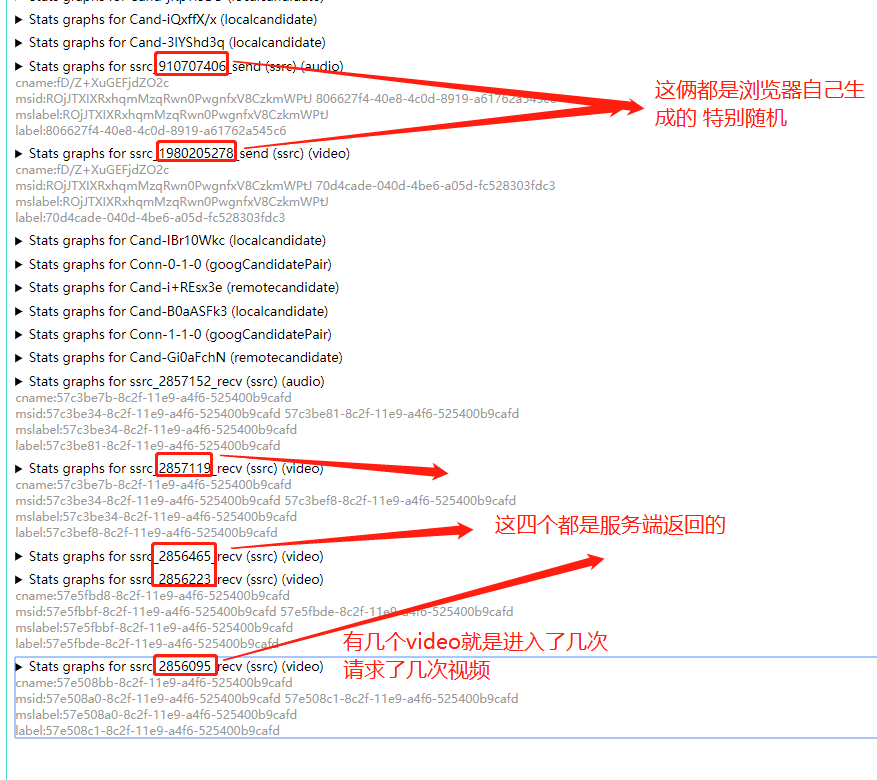
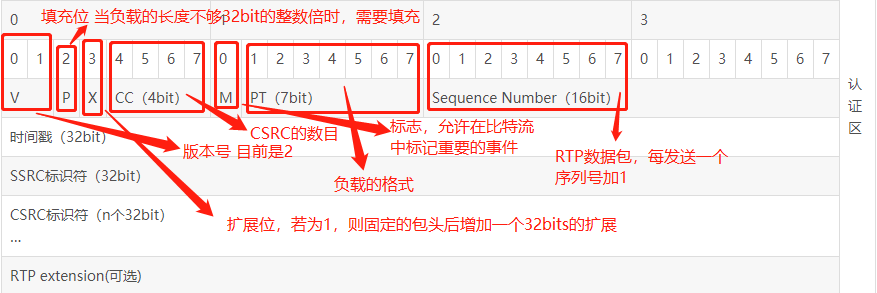
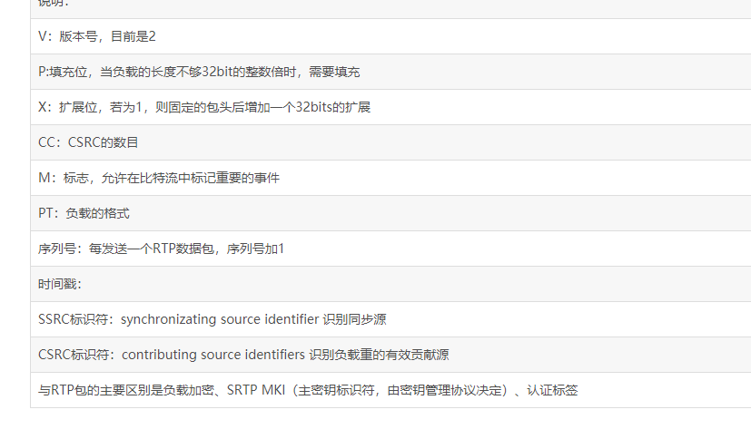

# WebRTC

研究webrtc这一块也有一段时间了，  
做一个总结吧。  

## 是什么?

Web的实时通信技术, 支持网页浏览器进行实时音视频对话的API, 而不需要安装插件。  
Webrtc提供视频会议的核心技术, 包括音视频采集、编解码、网络传输、显示等功能, 而且也支持跨平台。  

webrtc中文文档地址: [webrtc中文文档-MDN](https://developer.mozilla.org/zh-CN/docs/Web/API/WebRTC_API)  
webrtc官网地址: [webrtc官网(需要翻墙)](https://webrtc.org)  
    Developer ==> Getting started 之中会有很多Demos and samples可以帮助你更快的上手;  

书籍的话比较经典的一本: 《WebRTC权威指南》  

需要搞懂的也是我一直比较混的几个概念:  

1. 信令：有时候我们会将浏览器和服务器之前的连接称之为信令，但并非电话系统中所用的信令。信令在webrtc之中并未标准化, 因为它只是被视为应用程序的一部分。信令可以通过http或者webSocket传送到向浏览器提供HTML页面的同一Web服务器，也可传送到只负责处理信令的一个完全不同的Web服务器。  

2. 媒体协商：通信会话中的双方(例如两个浏览器)进行通信并就可接受的媒体会话达成一致的过程。  
"提议/应答"就是一种媒体协商方式。

## 怎么用?

### 建立WebRTC会话

   1. 获取本地媒体;  ==>  getUserMedia()
   2. 在浏览器和对等端(其他浏览器或者终端)之间建立连接;  ==>  RTCPeerConnection()  包含ICE"打洞"通过各种网络地址转换设备和防火墙时使用的信息;
   3. 将媒体和数据通道关联至该连接;  ==>  RTCSessionDescription()
   4. 交换会话描述。  ==> SDP会话描述协议;
    

## 本地媒体

### WebRTC中的媒体

轨道：MediaStreamTrack 基本媒体单元 
流：MediaStream 是 轨道：MediaStreamTrack对象的集合
媒体选择和控制
   可约束的属性：枚举属性和范围属性;

## 信令

### 作用

1. 协商媒体功能和设置;
2. 标识和验证会话参与者的身份;
3. 控制媒体会话、指示进度、更改会话和终止会话;
4. 当会话双方同时尝试建立或更改会话时，实施双占用分解。

目前是没有信令标准的，可自由选择。

### 媒体协商

信令最重要的功能在于，参与对等连接的两个浏览器之间交换会话描述协议(SDP)对象中包含的信息。  
SDP之中包含供浏览器中RTP媒体栈配置媒体会话所需的全部信息，包括媒体类型(音频、视频、数据)、所用的编解码器(Opus、G.711等)、用于编解码器的各个参数或设置，以及有关带宽的信息。  
此外，信令通道还用于交换候选地址，以便进行ICE打洞。
候选地址表示浏览器可从中接收潜在媒体数据包的IP地址和UDP端口。  
在信令通道中收发的候选地址也可以不包含在SDP之中。另外，还必须在信令通道中交换用于SRTP的密钥材料。  
只有通过信令交换候选地址后才能开始ICE打洞，因此如果没有此信令功能，就无法建立对等连接。  

本人认为知道以上概念很重要。  

信令传输方式： HTTP、WebSocket、数据通道;

1. HTTP  

浏览器发起新的HTTP请求，以便向服务器发送信令信息并从中接收信令信息。  
信令信息可以可使用GET和POST方法或以应答形式传输。

2. WebSocket

WebSocket传输允许浏览器开通一个与服务器的双向连接。此连接最初采用HTTP请求形式，但随后会升级为WebSocket。  
只要服务器支持CORS，WebSocket服务器的IP地址就可以不同于Web服务器。  
任何信令都可以通过WebSocket进行传输。  

为了访问WebSocket服务器，必须拥有公共IP地址。因为两个浏览器之间无法直接开通WebSocket，所以需要WebSocket服务器在两个使用WebSocket的浏览器之间提供中继。  

3. 数据通道传输

当两个浏览器建立数据通道后，它就会提供直接的低延迟连接，很适合传输信令。  
由于最初建立数据通道时需要单独的信令机制，因此信令通道无法单独用于所有WebRTC信令。但是一旦建立信令通道，可以用它来处理所有的信令。  

好处： 有助于缩短用户感知的建立连接所需的时间。 

## SDK封装调试时碰到的问题记录

### SDK之中添加进来adapter

adapter是sdk的兼容插件，作用是为了兼容各个浏览器以更好的支持webrtc；  

因为webrtc还没有出标准 所以各个浏览器之间就像是方言一般的存在 为了互通理解 所以需要添加进去adapter。  

webrtc-adapter使用步骤：  

[adapter介绍安装](https://www.javascriptcn.com/read-34969.html)

webrtc-adapter解释：  

[adapter介绍1](https://webrtc.org.cn/adapterjs-1/)  
[adapter介绍1](https://webrtc.org.cn/adapterjs-2/)
  
### webrtc-internal中追溯某一个流的途径

source ==> stream ==> track ==> sender/recevier

### 调试工具

chrome://webrtc-internals/  插件  

### SRTP

SRTP(SecureReal-time Transport Protocol) 安全实时传输协议，SRTP是在实时传输协议(Real-time Transport Protocol)基础上所定义的一个协议，旨在为单播和多播应用程序中的实时传输协议的数据提供加密、消息认证、完整性保证和重放保护安全实时传输协议。  

协议格式：  

### STUN/TURN

1，STUN服务器是用来取外网地址的；  
2，TURN服务器是在P2P失败时进行转发的；  

每个TURN服务器都支持STUN，ICE处理负责的NAT设置，同时NAT打洞要求不止是一个公网IP和端口。  

